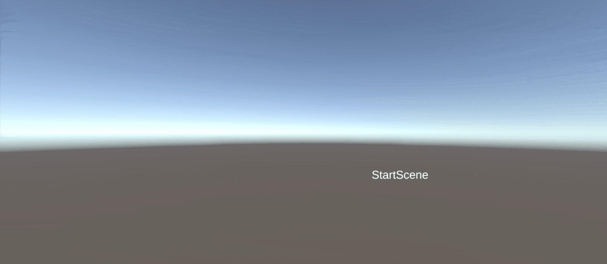
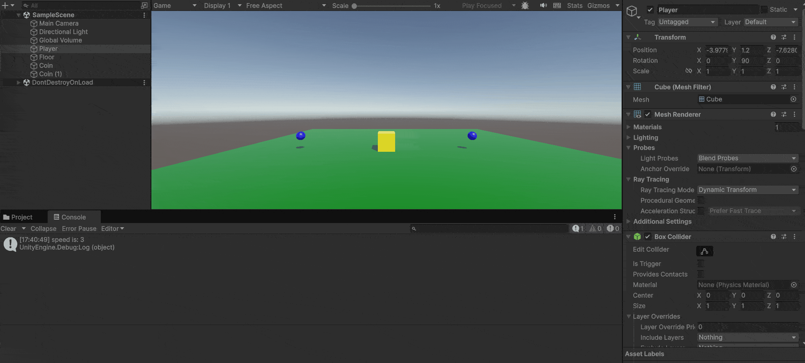
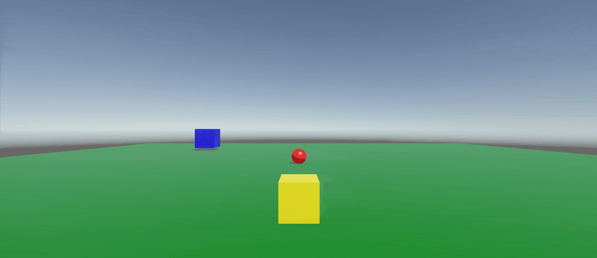

# M4Prog

## Opdracht 4: "Start en Spel"
Ik heb een "StartScene" die naar "GameScene" wisselt met spatie. In "GameScene" beweegt een speler en spawn ik een munt-prefab met een aanpasbare snelheid.

[Movement Script](M4Prog/Assets/Scripts/PlayerMove.cs)\
[Scene Switcher Script](M4Prog/Assets/Scripts/StartScene.cs)

## Opdracht 5: "Gestructureerde Muntjager"
Ik heb een scène met een speler (cube) die beweegt en een munt (cube) verzamelt. Ik gebruik twee scripts: één voor beweging en één voor score, met comments en debug-outputs.

[Movement Script](M4Prog/Assets/Scripts/PlayerMove.cs)\
[Score Manager Script](M4Prog/Assets/Scripts/ScoreManager.cs)

## Opdracht 6: "Volger"
ik heb een scène waarin een "volger" (sphere) de "speler" (cube) volgt met Vector3.Lerp. Als de speler bereikt is beweegt de volger weer terug naar zijn start positie met een constante snelheid.

De speler met pijltjestoetsen bewegen over de x- en z-as.

De afstand tussen de volger en de speler en de afstand tussen de volger en het startpunt wordt opgemeten. Zo kan er geschakeld worden tussen volgen en teruggaan.

[Volger Script](M4Prog/Assets/Scripts/FollowAndReturn.cs)
[Dummy Movement Script](M4Prog/Assets/Scripts/DummyMove.cs)
[Shoot Bullets Script](M4Prog/Assets/Scripts/BulletShoot.cs)
