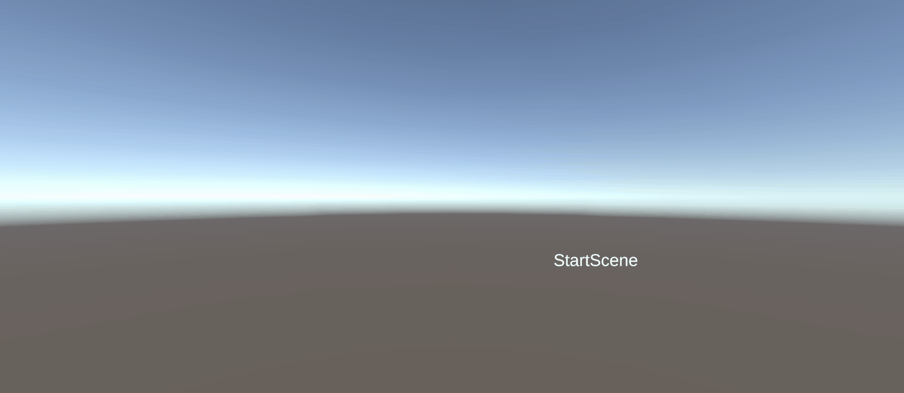

# M4Prog

## Opdracht 4: "Start en Spel"
Ik heb een "StartScene" die naar "GameScene" wisselt met spatie. In "GameScene" beweegt een speler en spawn je een munt-prefab met een aanpasbare snelheid.

[Movement Script](M4Prog/Assets/Scripts/Movement.cs)\
[Scene Switcher Script](M4Prog/Assets/Scripts/StartScene.cs)
