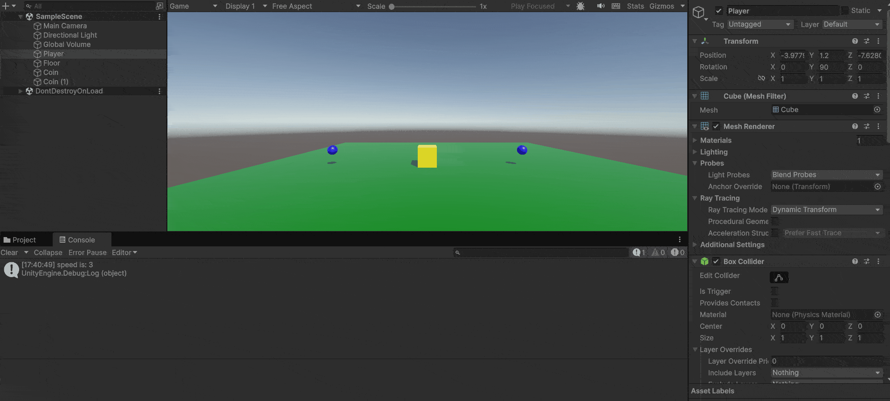

# M4Prog

## Opdracht 4: "Start en Spel"
Ik heb een "StartScene" die naar "GameScene" wisselt met spatie. In "GameScene" beweegt een speler en spawn je een munt-prefab met een aanpasbare snelheid.

[Movement Script](M4Prog/Assets/Scripts/PlayerMove.cs)\
[Scene Switcher Script](M4Prog/Assets/Scripts/StartScene.cs)

## Opdracht 5: "Gestructureerde Muntjager"
Ik heb een scène met een speler (cube) die beweegt en een munt (cube) verzamelt. Gebruik twee scripts: één voor beweging en één voor score, met comments en debug-outputs.

[Movement Script](M4Prog/Assets/Scripts/PlayerMove.cs)\
[Score Manager Script](M4Prog/Assets/Scripts/ScoreManager.cs)